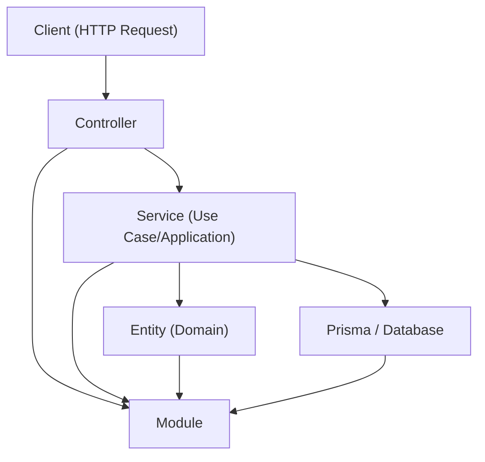

# Event Manager API - Real-time Event Management System

## Descripción General
 real-time event management system designed to handle event convention center with multiple rooms. The system ensures no ts in the same room while allowing concurrent events in 

Este es un sistema robusto de gestión de eventos en tiempo real diseñado para manejar la programación de eventos en un centro de convenciones con múltiples salas. El sistema garantiza que no haya eventos superpuestos en la misma sala mientras permite eventos concurrentes en diferentes salas.

##Características

### Core Functionality / Funcionalidad Principal
- **Event Registration**: Register new events with automatic overlap detection
- **Active Event Querying**: Find events active within a specific time range
- **Event Cancellation**: Cancel events by name
- **Room Management**: Manage multiple rooms with individual scheduling
- **Real-time Validation**: Prevent scheduling conflicts in real-time

### Additional Features / Funcionalidades Adicionales
- **Currently Active Events**: Get events happening right now
- **Upcoming Events**: Get future events with configurable limits
- **Room-specific Events**: Get all events for a specific room
- **Room Availability Check**: Check if a room is available for a time range
- **Comprehensive Error Handling**: Detailed error messages for all scenarios

##  Endpoints de la API

### Events / Eventos

| Method | Endpoint | Description |
|--------|----------|-------------|
| `POST` | `/events` | Create a new event |
| `GET` | `/events` | Get all events or events in time range |
| `GET` | `/events/active` | Get currently active events |
| `GET` | `/events/upcoming` | Get upcoming events (limit optional) |
| `GET` | `/events/room/:roomId` | Get events for specific room |
| `GET` | `/events/availability/:roomId` | Check room availability |
| `GET` | `/events/:id` | Get event by ID |
| `PATCH` | `/events/:id` | Update event |
| `DELETE` | `/events/:id` | Delete event by ID |
| `DELETE` | `/events?name=eventName` | Cancel event by name |

### Rooms / Salas

| Method | Endpoint | Description |
|--------|----------|-------------|
| `POST` | `/rooms` | Create a new room |
| `GET` | `/rooms` | Get all rooms |
| `GET` | `/rooms/:id` | Get room by ID |
| `PATCH` | `/rooms/:id` | Update room |
| `DELETE` | `/rooms/:id` | Delete room |

##  Arquitectura

###  Arquitectura Actual



Este proyecto sigue un patrón de **Arquitectura en Capas** con **principios de Clean Architecture**, implementado usando el framework NestJS. La arquitectura está diseñada para ser mantenible, testeable y escalable.

#### Architecture Diagram / Diagrama de Arquitectura

```
┌─────────────────────────────────────────────────────────────────────────────────────┐
│                              Client (HTTP Requests)                                 │
│  ┌─────────────────┐  ┌─────────────────┐  ┌─────────────────┐  ┌─────────────────┐ │
│  │   Create Event  │  │   Get Events    │  │  Update Event   │  │  Delete Event   │ │
│  │   POST /events  │  │   GET /events   │  │ PATCH /events/:id│  │DELETE /events/:id│ │
│  └─────────────────┘  └─────────────────┘  └─────────────────┘  └─────────────────┘ │
└─────────────────────────────┬───────────────────────────────────────────────────────┘
                              │
┌─────────────────────────────▼───────────────────────────────────────────────────────┐
│                           Controllers Layer                                        │
│  ┌─────────────────────────────────────────────────────────────────────────────────┐ │
│  │                        EventsController                                        │ │
│  │  ┌─────────────┐ ┌─────────────┐ ┌─────────────┐ ┌─────────────┐ ┌─────────────┐ │ │
│  │  │   create()  │ │   findAll() │ │   findOne() │ │   update()  │ │   remove()  │ │ │
│  │  │             │ │             │ │             │ │             │ │             │ │ │
│  │  │ • Validate  │ │ • Query     │ │ • Validate  │ │ • Validate  │ │ • Validate  │ │ │
│  │  │   DTOs      │ │   Params    │ │   ID        │ │   DTOs      │ │   ID        │ │ │
│  │  │ • Route to  │ │ • Route to  │ │ • Route to  │ │ • Route to  │ │ • Route to  │ │ │
│  │  │   Service   │ │   Service   │ │   Service   │ │   Service   │ │   Service   │ │ │
│  │  └─────────────┘ └─────────────┘ └─────────────┘ └─────────────┘ └─────────────┘ │ │
│  └─────────────────────────────────────────────────────────────────────────────────┘ │
│                              │                                                      │
│  ┌─────────────────────────────────────────────────────────────────────────────────┐ │
│  │                        RoomsController                                         │ │
│  │  ┌─────────────┐ ┌─────────────┐ ┌─────────────┐ ┌─────────────┐ ┌─────────────┐ │ │
│  │  │   create()  │ │   findAll() │ │   findOne() │ │   update()  │ │   remove()  │ │ │
│  │  └─────────────┘ └─────────────┘ └─────────────┘ └─────────────┘ └─────────────┘ │ │
│  └─────────────────────────────────────────────────────────────────────────────────┘ │
└─────────────────────────────┬───────────────────────────────────────────────────────┘
                              │
┌─────────────────────────────▼───────────────────────────────────────────────────────┐
│                            Services Layer                                          │
│  ┌─────────────────────────────────────────────────────────────────────────────────┐ │
│  │                         EventsService                                          │ │
│  │  ┌─────────────────────────────────────────────────────────────────────────────┐ │ │
│  │  │                           Business Logic                                   │ │ │
│  │  │  ┌─────────────┐ ┌─────────────┐ ┌─────────────┐ ┌─────────────┐            │ │ │
│  │  │  │   create()  │ │   findAll() │ │   findOne() │ │   update()  │            │ │ │
│  │  │  │             │ │             │ │             │ │             │            │ │ │
│  │  │  │ • Validate  │ │ • Get all   │ │ • Find by   │ │ • Validate  │            │ │ │
│  │  │  │   times     │ │   events    │ │   ID        │ │   times     │            │ │ │
│  │  │  │ • Check     │ │ • Include   │ │ • Include   │ │ • Check     │            │ │ │
│  │  │  │   overlaps  │ │ • Order by  │ │ • Return    │ │ • Validate  │            │ │ │
│  │  │  │   room      │ │   time      │ │   event     │ │   name      │            │ │ │
│  │  │  │ • Create    │ │ • Return    │ │   or null   │ │ • Update    │            │ │ │
│  │  │  │   event     │ │   events    │ │             │ │   event     │            │ │ │
│  │  │  └─────────────┘ └─────────────┘ └─────────────┘ └─────────────┘            │ │ │
│  │  └─────────────────────────────────────────────────────────────────────────────┘ │ │
│  │                                                                                 │ │
│  │  ┌─────────────────────────────────────────────────────────────────────────────┐ │ │
│  │  │                    Specialized Methods                                     │ │ │
│  │  │  ┌─────────────┐ ┌─────────────┐ ┌─────────────┐ ┌─────────────┐            │ │ │
│  │  │  │findActive-  │ │findCurrent- │ │ findUp-     │ │getRoom-     │            │ │ │
│  │  │  │ Between()   │ │ lyActive()  │ │ coming()    │ │Availability()│            │ │ │
│  │  │  │             │ │             │ │             │ │             │            │ │ │
│  │  │  │ • Time      │ │ • Current   │ │ • Future    │ │ • Check     │            │ │ │
│  │  │  │   range     │ │ • Active    │ │ • Limit     │ │ • Room      │            │ │ │
│  │  │  │ • Overlap   │ │ • Return    │ │   results   │ │   status    │            │ │ │
│  │  │  │   logic     │ │ • Return    │ │   results   │ │   status    │            │ │ │
│  │  │  │   room      │ │   event     │ │             │ │   status    │            │ │ │
│  │  │  │ • Create    │ │   or null   │ │             │ │   status    │            │ │ │
│  │  │  └─────────────┘ └─────────────┘ └─────────────┘ └─────────────┘            │ │ │
│  │  └─────────────────────────────────────────────────────────────────────────────┘ │ │
│  └─────────────────────────────────────────────────────────────────────────────────┘ │
│                              │                                                      │
│  ┌─────────────────────────────────────────────────────────────────────────────────┐ │
│  │                         RoomsService                                           │ │
│  │  ┌─────────────┐ ┌─────────────┐ ┌─────────────┐ ┌─────────────┐ ┌─────────────┐ │ │
│  │  │   create()  │ │   findAll() │ │   findOne() │ │   update()  │ │   remove()  │ │ │
│  │  └─────────────┘ └─────────────┘ └─────────────┘ └─────────────┘ └─────────────┘ │ │
│  └─────────────────────────────────────────────────────────────────────────────────┘ │
└─────────────────────────────┬───────────────────────────────────────────────────────┘
                              │
┌─────────────────────────────▼───────────────────────────────────────────────────────┐
│                         Data Access Layer                                         │
│  ┌─────────────────────────────────────────────────────────────────────────────────┐ │
│  │                          PrismaService                                        │ │
│  │  ┌─────────────────────────────────────────────────────────────────────────────┐ │ │
│  │  │                        Database Operations                                 │ │ │
│  │  │  ┌─────────────┐ ┌─────────────┐ ┌─────────────┐ ┌─────────────┐            │ │ │
│  │  │  │   create()  │ │  findMany() │ │ findUnique()│ │   update()  │            │ │ │
│  │  │  │             │ │             │ │             │ │             │            │ │ │
│  │  │  │ • Insert    │ │ • Select    │ │ • Select    │ │ • Update    │            │ │ │
│  │  │  │   record    │ │   multiple  │ │   single    │ │   record    │            │ │ │
│  │  │  │ • Return    │ │ • Filter    │ │ • Where     │ │   updated   │            │ │ │
│  │  │  │   created   │ │ • Include   │ │   clause    │ │   data      │            │ │ │
│  │  │  │             │ │ • Order     │ │ • Include   │ │             │            │ │ │
│  │  │  │             │ │ • Paginate  │ │ • Return    │ │             │            │ │ │
│  │  │  └─────────────┘ └─────────────┘ └─────────────┘ └─────────────┘            │ │ │
│  │  └─────────────────────────────────────────────────────────────────────────────┘ │ │
│  └─────────────────────────────────────────────────────────────────────────────────┘ │
└─────────────────────────────┬───────────────────────────────────────────────────────┘
                              │
┌─────────────────────────────▼───────────────────────────────────────────────────────┐
│                              Database                                              │
│  ┌─────────────────────────────────────────────────────────────────────────────────┐ │
│  │  ┌─────────────────┐                    ┌─────────────────┐                    │ │
│  │  │     Events      │                    │     Rooms       │                    │ │
│  │  │     Table       │                    │     Table       │                    │ │
│  │  │                 │                    │                 │                    │ │
│  │  │ • id (PK)       │◄───────────────────┤ • id (PK)       │                    │ │
│  │  │ • name (Unique) │     Foreign Key    │ • name          │                    │ │
│  │  │ • roomId (FK)   │     roomId         │ • capacity      │                    │ │
│  │  │ • startTime     │                    │ • description   │                    │ │
│  │  │ • endTime       │                    │ • createdAt     │                    │ │
│  │  │ • createdAt     │                    │ • updatedAt     │                    │ │
│  │  │ • updatedAt     │                    │                 │                    │ │
│  │  └─────────────────┘                    └─────────────────┘                    │ │
│  └─────────────────────────────────────────────────────────────────────────────────┘ │
└─────────────────────────────────────────────────────────────────────────────────────┘

┌─────────────────────────────────────────────────────────────────────────────────────┐
│                           Data Flow Example                                        │
│                                                                                     │
│  Client Request: POST /events                                                       │
│  ┌─────────────┐    ┌─────────────┐    ┌─────────────┐    ┌─────────────┐         │
│  │   Client    │───▶│ Controller  │───▶│   Service   │───▶│   Prisma    │         │
│  │             │    │             │    │             │    │             │         │
│  │ • Send JSON │    │ • Validate  │    │ • Business  │    │ • Database  │         │
│  │   data      │    │   DTO       │    │   Logic     │    │   Query     │         │
│  │             │    │ • Route to  │    │ • Check     │    │ • Insert    │         │
│  │             │    │   Service   │    │   Overlaps  │    │   Record    │         │
│  └─────────────┘    └─────────────┘    └─────────────┘    └─────────────┘         │
│         ▲                   │                   │                   │             │
│         │                   ▼                   ▼                   ▼             │
│         │            ┌─────────────┐    ┌─────────────┐    ┌─────────────┐         │
│         │            │   Return    │    │   Return    │    │   Return    │         │
│         │            │   Response  │    │   Event     │    │   Created   │         │
│         │            │             │    │   Object    │    │   Data      │         │
│         └────────────┴─────────────┴────┴─────────────┴────┴─────────────┘         │
└─────────────────────────────────────────────────────────────────────────────────────┘
```

#### Layer Responsibilities / Responsabilidades de las Capas

**1. Controllers Layer / Capa de Controladores**
- Handle HTTP requests and responses
- Input validation using DTOs
- Route requests to appropriate services
- Return formatted responses

- Maneja peticiones y respuestas HTTP
- Validación de entrada usando DTOs
- Enruta peticiones a los servicios apropiados
- Retorna respuestas formateadas

**2. Services Layer / Capa de Servicios**
- Contains business logic
- Data validation and transformation
- Orchestrates operations
- Handles complex business rules

- Contiene la lógica de negocio
- Validación y transformación de datos
- Orquesta operaciones
- Maneja reglas de negocio complejas

**3. Data Access Layer / Capa de Acceso a Datos**
- Database operations through Prisma ORM
- Query optimization
- Transaction management
- Data persistence

- Operaciones de base de datos a través de Prisma ORM
- Optimización de consultas
- Manejo de transacciones
- Persistencia de datos

#### Why This Architecture? / ¿Por qué Esta Arquitectura?

**1. Separation of Concerns / Separación de Responsabilidades**
- Each layer has a specific responsibility
- Easy to understand and maintain
- Changes in one layer don't affect others

- Cada capa tiene una responsabilidad específica
- Fácil de entender y mantener
- Los cambios en una capa no afectan a otras

**2. Testability / Testeabilidad**
- Each layer can be tested independently
- Easy to mock dependencies
- High test coverage achievable

- Cada capa puede ser testeada independientemente
- Fácil de hacer mock de dependencias
- Alta cobertura de pruebas alcanzable

**3. Scalability / Escalabilidad**
- Easy to add new features
- Modular structure allows for growth
- Performance optimization at each layer

- Fácil agregar nuevas funcionalidades
- Estructura modular permite el crecimiento
- Optimización de rendimiento en cada capa

**4. Maintainability / Mantenibilidad**
- Clear code organization
- Easy to debug and fix issues
- Consistent patterns across the application

- Organización clara del código
- Fácil debuggear y arreglar problemas
- Patrones consistentes en toda la aplicación

#### Clean Architecture Principles Applied / Principios de Clean Architecture Aplicados

**1. Dependency Rule / Regla de Dependencias**
- Dependencies point inward: Controllers → Services → Prisma
- No circular dependencies
- Business logic is independent of external concerns

- Las dependencias apuntan hacia adentro: Controladores → Servicios → Prisma
- Sin dependencias circulares
- La lógica de negocio es independiente de preocupaciones externas

**2. Abstraction / Abstracción**
- Services abstract business logic from HTTP concerns
- Prisma abstracts database operations
- DTOs abstract data transfer concerns

- Los servicios abstraen la lógica de negocio de las preocupaciones HTTP
- Prisma abstrae las operaciones de base de datos
- Los DTOs abstraen las preocupaciones de transferencia de datos

**3. Independence / Independencia**
- Business logic doesn't depend on framework details
- Easy to change database or framework without affecting core logic
- Testable without external dependencies

- La lógica de negocio no depende de detalles del framework
- Fácil cambiar base de datos o framework sin afectar la lógica central
- Testeable sin dependencias externas

## Design Decisions / Decisiones de Diseño

### 1. Database Design / Diseño de Base de Datos

**Choice**: PostgreSQL with Prisma ORM
- **Justification**: PostgreSQL provides excellent support for datetime operations and complex queries needed for overlap detection
- **Indexing Strategy**: Composite index on `(roomId, startTime, endTime)` for efficient overlap queries
- **Relationships**: One-to-many relationship between rooms and events

### 2. Overlap Detection Algorithm / Algoritmo de Detección de Superposición

**Logic**: Two events overlap if:
```sql
event1.startTime < event2.endTime AND event1.endTime > event2.startTime
```

**Implementation**: Used Prisma's `AND` conditions for precise overlap detection
- Handles edge cases like events starting/ending at the same time
- Efficient database queries with proper indexing

### 3. Validation Strategy / Estrategia de Validación

**Multi-layer Validation**:
1. **DTO Level**: Class-validator decorators for input validation
2. **Custom Validators**: Custom validator for end-time-after-start-time logic
3. **Service Level**: Business logic validation (room existence, name uniqueness)
4. **Database Level**: Unique constraints and foreign key relationships

### 4. Error Handling / Manejo de Errores

**Comprehensive Error Messages**:
- Specific error messages for each validation failure
- Detailed overlap conflict information including conflicting event details
- Proper HTTP status codes (400, 404, 500)

### 5. Performance Considerations / Consideraciones de Rendimiento

**Optimizations**:
- Database indexes for frequent queries
- Efficient overlap detection queries
- Pagination support for large datasets
- Proper query optimization with Prisma

## Installation & Setup / Instalación y Configuración

### Prerequisites / Prerrequisitos
- Node.js (v18+)
- PostgreSQL
- npm or yarn

### Installation Steps / Pasos de Instalación

1. **Clone the repository**
```bash
git clone <repository-url>
cd event_manager
```

2. **Install dependencies**
```bash
npm install
```

3. **Environment setup**
```bash
cp .env.example .env
# Configure DATABASE_URL in .env file
```

4. **Database setup**
```bash
npx prisma generate
npx prisma migrate dev
npx prisma db seed
```

5. **Run the application**
```bash
npm run start:dev
```

## Testing / Pruebas

### ¿Por qué utilizamos Jest?

Utilizo **Jest** como librería de testing porque es el estándar en aplicaciones NestJS y ofrece una integración sencilla, rápida y poderosa para pruebas unitarias y de integración.

Jest permite:
- Escribir tests claros y legibles.
- Ejecutar pruebas de manera rápida gracias a su motor de ejecución paralelo.
- Generar reportes de cobertura de código automáticamente.
- Simular (mock) dependencias fácilmente, lo que facilita el aislamiento de componentes.
- Integración nativa con TypeScript y soporte para pruebas E2E.

Esto asegura que el código sea confiable, fácil de mantener y que los errores se detecten antes de llegar a producción.

### Run Tests / Ejecutar Pruebas
```bash
# Unit tests
npm run test

# E2E tests
npm run test:e2e

# Test coverage
npm run test:cov
```

### Test Coverage / Cobertura de Pruebas
- ✅ Event creation with overlap detection
- ✅ Event updates with validation
- ✅ Active event queries
- ✅ Event cancellation
- ✅ Edge cases (same start/end times)
- ✅ Error scenarios

## API Examples / Ejemplos de API

### Create Event / Crear Evento
```bash
curl -X POST http://localhost:3000/events \
  -H "Content-Type: application/json" \
  -d '{
    "name": "Tech Conference 2024",
    "roomId": 1,
    "startTime": "2024-01-15T09:00:00Z",
    "endTime": "2024-01-15T17:00:00Z"
  }'
```

### Check Active Events / Verificar Eventos Activos
```bash
curl "http://localhost:3000/events?start=2024-01-15T08:00:00Z&end=2024-01-15T18:00:00Z"
```

### Cancel Event by Name / Cancelar Evento por Nombre
```bash
curl -X DELETE "http://localhost:3000/events?name=Tech%20Conference%202024"
```

### Check Room Availability / Verificar Disponibilidad de Sala
```bash
curl "http://localhost:3000/events/availability/1?start=2024-01-15T10:00:00Z&end=2024-01-15T12:00:00Z"
```

## Edge Cases Handled / Casos Extremos Manejados

1. **Exact Time Overlaps**: Events starting/ending at exactly the same time
2. **Invalid Date Formats**: Proper validation and error messages
3. **Non-existent Resources**: Room/event not found scenarios
4. **Duplicate Names**: Prevention of duplicate event names
5. **Invalid Time Ranges**: Start time after end time validation

## Scalability Considerations / Consideraciones de Escalabilidad

### Current Capacity / Capacidad Actual
- **Events**: Hundreds of events efficiently managed
- **Rooms**: Dozens of rooms with individual scheduling
- **Concurrent Users**: Multiple users can create/query events simultaneously

### Future Extensions / Extensiones Futuras
- **User Authentication**: Add user management and permissions
- **Event Categories**: Support for different event types
- **Recurring Events**: Support for recurring event patterns
- **Notifications**: Real-time notifications for conflicts
- **Analytics**: Event statistics and reporting
- **Calendar Integration**: External calendar system integration

## Performance Metrics / Métricas de Rendimiento

- **Overlap Detection**: O(log n) with proper indexing
- **Event Creation**: O(1) average case
- **Active Event Queries**: O(log n) with time range indexing
- **Room Availability**: O(log n) with composite indexing

## Security Considerations / Consideraciones de Seguridad

- **Input Validation**: Comprehensive validation at all layers
- **SQL Injection Prevention**: Prisma ORM provides automatic protection
- **Error Information**: Detailed errors for debugging without exposing sensitive data
- **Rate Limiting**: Ready for rate limiting implementation

## Contributing / Contribución

1. Fork the repository
2. Create a feature branch
3. Make your changes
4. Add tests for new functionality
5. Ensure all tests pass
6. Submit a pull request


